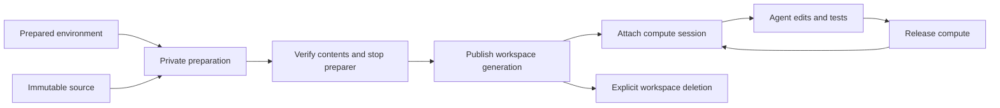

# Durable workspaces for B4 developer agents

**Recommendation: do not ship the proposed `initialize: { version, command, timeoutMs }` API as a durable, run-once guarantee.** Build the next increment around creating a workspace from a known source and reconnecting to that workspace. Keep environment preparation, workspace creation, compute startup, and task execution separate. Prove recovery behavior before selecting the public API.

The code-fixer example exposes a real framework gap, but a general initializer would hide that gap behind a small configuration object. An arbitrary command can change files, start background processes, and perform external side effects. Neither a successful exit nor a separate completion record makes those changes atomic. Kubernetes explicitly documents repeat execution for init containers and possible duplicate execution even for a single-completion Job. [1](https://kubernetes.io/docs/concepts/workloads/pods/init-containers/#detailed-behavior) [2](https://kubernetes.io/docs/concepts/workloads/controllers/job/#handling-pod-and-container-failures)

The strongest immediate application is narrower: prepare the two code-fixer fixture sources and dependencies ahead of time, materialize a fresh private workspace, verify its initial contents, and publish its identity before admitting agent tools. Reconnecting must preserve edits. An interrupted unpublished preparation may be replaced; a published workspace must never be silently reseeded.

This is an architectural recommendation, not a completed implementation. The source audit covers local commit `e15f455e` on `blove/code-fixer-app-correction`. External documentation was accessed on September 14, 2026. Provider documentation describes current behavior; it does not establish conformance of B4's adapters or prove vendor performance under B4 workloads.

## Existing failure path

The example currently wraps the Docker provider with `seededProvider`. Its initialized set and acquisition promises live in process memory. `seedFixture` writes original source files into the acquired workspace, creates a dependency symlink, and creates a Git baseline. Any seeding failure calls `destroy`, which removes the workspace. The provider contract, meanwhile, deliberately retains workspace storage across compute release and supports reattachment. These semantics conflict. [17](#repository-evidence)

A concrete restart sequence follows directly from the code:

1. An attempt creates a workspace, seeds the fixture, and edits a source file.
2. The host process exits while the named volume remains.
3. A new process acquires the same scoped thread. Its initialized set is empty.
4. Seeding overwrites source files with the original fixture before running setup.
5. The unguarded `ln -s` command can fail when the destination already exists. With a symlink to a directory, it can attempt to create a link inside the read-only dependency tree instead.
6. If setup fails, the wrapper's error handler destroys the acquired workspace.

This is a source-derived failure path, not a newly executed restart experiment. Its precondition is reusing the thread and retained volume. A harness that always creates fresh attempt IDs can conceal it. Simply making the symlink command idempotent would remove one error while leaving the destructive source overwrite intact.

The app also stores baselines in a host `Map`, uses a global registry to join separate module caches, assumes exactly one active handle when verifying, and appends thread IDs to a host file for cleanup after worker termination. These choices serve a controlled process-per-attempt harness. They are poor foundations for an ordinary multi-thread application. Moving them verbatim into a package would relocate the fragility rather than resolve it. [17](#repository-evidence)

The recently implemented resource scope remains useful. It distinguishes resources belonging to different installation/thread combinations. It does not record whether initialization completed, distinguish successive physical incarnations of a resource, authenticate ownership, or serialize two hosts. Names answer where to look; they do not establish what happened there.

## Findings from established systems

| System | Documented mechanism | Implication for B4 |
|---|---|---|
| Docker | Named volumes persist independently of containers; an empty volume can receive image contents on mount. | Separate data lifetime from compute. Do not equate empty storage with an uninitialized logical workspace. |
| Kubernetes | Init containers gate startup but can repeat. Jobs also permit duplicate execution. | Native execution mechanisms need an explicit retry-safe workload contract. |
| Dev Containers | Creation, content refresh, startup, and attachment have distinct lifecycle commands; `waitFor` selects the connection gate. | A single initialization hook conflates several useful events. |
| Coder | Persistent and ephemeral resources have different stop/start behavior under a workspace control plane. | Represent the workspace separately from the current compute session. |
| E2B | Templates are prepared snapshots; control-plane placement/state is separate from node orchestration. | Fast readiness is partly achieved by moving preparation out of the request path. |
| Daytona | Persistence and deletion policies are explicit; storage and sandbox state have separate lifecycle options. | Retention is a product contract, not an incidental absence of cleanup. |
| Modal | Filesystem snapshots are images that can create new sandboxes; snapshot retention is separately managed. | An immutable starting point and a mutable running workspace are distinct resources. |

Sources: Docker [3](https://docs.docker.com/engine/storage/volumes/); Kubernetes [1](https://kubernetes.io/docs/concepts/workloads/pods/init-containers/), [2](https://kubernetes.io/docs/concepts/workloads/controllers/job/); Dev Containers [4](https://raw.githubusercontent.com/devcontainers/spec/main/docs/specs/devcontainerjson-reference.md); Coder [5](https://coder.com/docs/user-guides/workspace-lifecycle); E2B [6](https://raw.githubusercontent.com/e2b-dev/runtime/main/docs/ARCHITECTURE.md); Daytona [7](https://www.daytona.io/docs/en/persistence/); Modal [8](https://modal.com/docs/guide/sandbox-snapshots).

These systems do not establish one universal implementation. Coder provisions through Terraform, while E2B's architecture includes a dedicated control plane, node orchestrators, and snapshot storage. Copying either platform into B4 would be a large expansion of scope. The transferable design is the separation of responsibilities; vendor internals are not a recommended dependency list.

Dev Containers offers an especially useful counterpoint: lifecycle hooks are legitimate when their execution point and retry assumptions are explicit. B4 may eventually need startup or preparation commands. The objection is to claiming durable one-time effects for arbitrary commands, not to commands themselves. B4 should not adopt the entire Dev Container lifecycle vocabulary without a demonstrated agent use case.

Snapshot support is also not portable by default. Kubernetes PVC cloning requires a supporting CSI driver and dynamic provisioner, with source/destination constraints. A B4 contract should permit a provider to optimize creation through cloning, while a bounded file-copy path remains possible. It should report unsupported capabilities rather than silently equate all storage backends. [9](https://kubernetes.io/docs/concepts/storage/volume-pvc-datasource/)

## Why a durable initializer is insufficient

### The completion-record gap

Consider setup that copies files and then records success in provider metadata. If the host disappears after the copy but before the record, recovery cannot infer from the missing record that no work occurred. Recording success first creates the opposite failure: a ready record can point at partial contents. A marker inside the workspace is also writable by the agent unless protected separately, and its presence does not prove the rest of the filesystem is complete.

AWS's idempotent API guidance uses caller request identity to distinguish retries from new intent, and emphasizes atomicity between recording an idempotency token and applying the operation. A content hash alone cannot distinguish two intentionally separate creations from one retried creation. For B4, an image digest, a fixture digest, and a creation request ID serve different purposes. [10](https://aws.amazon.com/builders-library/making-retries-safe-with-idempotent-APIs/)

A database transaction cannot automatically include Docker volume writes. The practical design must acknowledge that boundary. One option is to build a complete, unexposed generation, stop its preparer, and atomically select that generation in trusted metadata. Orphaned generations can then be reconciled without modifying the selected workspace. This is a proposed protocol that still needs fault testing, not a transaction guarantee obtained merely by adding a database.

### Durable orchestration does not make arbitrary effects exactly once

Temporal separates orchestration from activities that perform external work. Its documentation explains at-least-once activity execution and the need for idempotency because activity effects are not atomic with workflow history. Wrapping sandbox setup in a durable workflow can preserve scheduling and results; it cannot by itself make filesystem or network effects happen once. [11](https://temporal.io/blog/idempotency-and-durable-execution)

Likewise, B4's agent checkpoints and its workspace should have independent, explicit contracts. Persisting conversation state is necessary for resume, but does not prove that a corresponding external shell operation completed or that the retained volume still exists. LangGraph documents that an in-memory checkpointer loses state on restart and provides persistent alternatives. The additional workspace reconciliation requirement is an architectural inference, not a guarantee supplied by a checkpointer. [12](https://docs.langchain.com/oss/javascript/langgraph/persistence)

### A lease is not termination

A timed-out preparer may still be executing. A host can pause between checking ownership and writing. AWS's discussion of leader election describes the difficulty of keeping effects within lease ownership during network delays and process pauses. A heartbeat or lease alone is insufficient evidence that an old worker can no longer mutate storage. [13](https://aws.amazon.com/it/builders-library/leader-election-in-distributed-systems/)

For initialization, separate storage for each preparation attempt limits this problem: an obsolete preparer cannot corrupt another attempt's generation. Before publishing an attempt, B4 must establish that its preparation process and relevant descendants have stopped, or use a provider-supported immutable snapshot of the result. A stale attempt must also be unable to publish itself after losing ownership. These are separate requirements.

This does not solve concurrent editing of an already published workspace. Live writers need their own admission and termination model. For the first code-fixer implementation, one active mutating run per workspace is a sensible constraint. Distributed takeover must wait for confirmed termination or an enforceable storage/compute fence; an uncertain host should yield an explicit unavailable state rather than speculative concurrent access.

### Resource names and garbage collection are not a ledger

Kubernetes exposes object UIDs, conditional updates using `resourceVersion`, and operation preconditions. These provide tools for detecting replacement and stale metadata updates. They do not make a metadata update atomic with shell writes into a mounted volume. B4's current Pod/PVC client interface does not expose the lifecycle identity and conditional operations needed for the proposed protocol; its NetworkPolicy replacement already uses resource versions, which is a separate concern. [14](https://kubernetes.io/docs/reference/using-api/api-concepts/) [15](https://kubernetes.io/docs/reference/kubernetes-api/definitions/preconditions-v1-meta/) [17](#repository-evidence)

Keeping a completed setup Pod forever as a receipt would interact badly with the current chart reaper. That script regards every Pod reference to a PVC as bound, regardless of Pod phase. A retained setup Pod could therefore prevent intended storage cleanup. Conversely, Kubernetes can garbage-collect completed Jobs and their dependent objects, so a Job is not an independently durable workspace record. [16](https://kubernetes.io/docs/concepts/workloads/controllers/ttlafterfinished/) [17](#repository-evidence)

The existing Docker release/destroy paths suppress thrown cleanup errors and do not inspect command exit codes. Kubernetes teardown also suppresses some failures. A new ownership protocol must distinguish confirmed absence from failed inspection or failed deletion; otherwise it can report success while resources remain. This is a concrete audit finding, not evidence that every cleanup currently fails.

## Recommended model

Use five concepts internally before choosing exported names:

| Concept | Meaning | Lifetime |
|---|---|---|
| Environment | Runtime image and dependencies, identified by resolved artifact identity | Shared across compatible workspaces |
| Source | Initial project contents and provenance, such as an archive digest or repository commit | Immutable input to creation |
| Workspace | Owned mutable project with a selected storage generation | Survives compute replacement |
| Session | Current compute attachment and active use | Can stop without deleting workspace |
| Run | Agent execution, verification, and approval state | May resume against an existing workspace |

The initial runtime may continue mapping one conversation thread to one workspace. It should store that association rather than requiring a thread ID to double as every resource identity. A fixture change then expresses a new task/workspace choice, while reconnecting remains an operation on an existing workspace.

Publication means that trusted control state names one validated generation and only that generation is available to ordinary agent tools. It does not mean the project stays immutable after publication. Verification of a proposed code change is a later operation against a separately captured candidate.

For a first implementation, the source operation should be deliberately constrained: materialize a bounded, immutable project artifact into a newly allocated workspace. Avoid arbitrary network side effects during this operation. If fixture preparation needs Git metadata, produce it deterministically during artifact preparation or through a controlled provider step before publication. Archive extraction must reject path traversal and unsafe link destinations; task-specific source paths and expected contents still belong to the fixture definition.

The application should ultimately declare the environment and select the task source, then implement its repair and review tools using normal B4 context. It should not contain initialized sets, handle registries, cleanup journals, or subprocess ownership conventions. Exact TypeScript syntax should follow a passing lifecycle prototype. Publishing attractive configuration before proving semantics would repeat the original mistake.

## Versioning and recovery policy

An app deployment version, environment version, and source version should not share a single `initialize.version` field. Record the environment and source used to create each workspace. A new deployment can set new defaults for future workspaces while existing workspaces retain their provenance and edits.

When a workspace's environment is no longer available or a policy change makes attachment unsafe, return a specific incompatibility condition. Offer an explicit environment migration, workspace fork, or new attempt where appropriate. Do not silently reset the project. For code-fixer, a new fixture is naturally a new attempt; it need not invalidate an unrelated retained attempt.

The earlier recommendation to require a new thread whenever the initializer version changes is too coarse. It confuses application rollout with task identity and would make ordinary deployment operationally disruptive. A new thread remains a valid user action, but should not be the universal recovery mechanism.

Retention must cover workspace metadata, storage, and required source/environment artifacts together. A ready record whose storage is missing is a lost workspace, not permission to create an empty replacement. An existing volume without trusted metadata is an unknown resource requiring reconciliation or explicit import. Agent-authored marker files must not resolve either ambiguity.

## Failure contract to prove

The following are proposed acceptance properties. They have not been demonstrated by the current initializer design.

| Failure or race | Required outcome |
|---|---|
| Create succeeds but acknowledgement is lost | Retry identifies the same logical request; inspect owned resources before allocating again. |
| Host exits midway through copying | No agent sees partial files; retry uses safely recoverable or fresh private storage. |
| Preparation completes before metadata publication | Recovery validates the stopped attempt or discards only unpublished storage; no blind rerun on live data. |
| Two processes request the same workspace | One selected generation; losers cannot publish or delete the winner. |
| Old preparer resumes after takeover | It can affect only its own private storage and cannot publish. |
| Process restarts after user edits | Reattach the selected workspace without executing source seeding. |
| One waiting request cancels | Stop that wait; do not automatically destroy shared preparation needed by another request. |
| Setup exceeds deadline | Record timeout separately from confirmed termination; no publish until effects are bounded. |
| Old session operates after resource replacement | Reject stale session identity or bind operations to a physical instance that cannot target its replacement. |
| Deletion races with acquire | A deleting state prevents new attachment; cleanup targets the intended incarnation. |
| Provider inspection fails | Return unknown/unavailable; never interpret transport failure as absence. |
| Workspace storage disappears | Surface data loss and recovery options; never silently regenerate original content. |
| Environment defaults change | Existing workspace provenance remains intact; compatibility is evaluated explicitly. |
| Reaper overlaps a valid retained workspace | Retention authority prevents accidental deletion; compute idleness alone is insufficient. |
| Cleanup partially succeeds | Preserve retryable cleanup state and report the remaining resources. |

Kubernetes `ReadWriteOnce` is not a substitute for this contract: access modes do not themselves provide general write protection, and RWO is not an application-level one-writer lock. The B4 client currently requests RWO. Any stronger claim needs a tested storage-driver and admission configuration. [18](https://kubernetes.io/docs/concepts/storage/persistent-volumes/#access-modes) [17](#repository-evidence)

## Scope of the library and infrastructure changes

Extend the existing lifecycle path rather than introducing a second runtime beside `SandboxManager`. The manager currently deduplicates acquisition in one process; its `inUse` counter covers acquisition, not the entire run. Docker additionally has local execution/lifecycle coordination. Those mechanisms should be evaluated together before claiming a run can be safely reaped or taken over. This audit does not establish the complete end-to-end idle-reap behavior. [17](#repository-evidence)

| Responsibility | Recommended owner |
|---|---|
| Workspace association, preparation state, admission, restart reconciliation | B4 runtime lifecycle layer |
| Durable records and conditional state transitions | A storage contract integrated with B4 persistence |
| Physical resources, attachment, inspection, termination, provider capabilities | Sandbox provider |
| Retention, orphan reconciliation, operational visibility | Infrastructure using the same ownership model |
| Fixture selection, allowed changes, independent tests, review content | Code-fixer application |
| Per-case disposable lifetime and cleanup outcome | Evaluation runner using supported lifecycle APIs |

Do not immediately require a new database service for local Docker. A single-host implementation may use local durable state, provided it coordinates independent processes and accounts for container processes that survive the host application. Shared deployments need a shared authority or a provider that already supplies it. SQLite and Postgres support elsewhere in B4 are integration candidates, not proof that their current interfaces support the required conditional transitions.

For Kubernetes, choose the authority deliberately: a B4 storage-backed manager or a Kubernetes-native controller can each be coherent. Maintaining independent authoritative records in both creates reconciliation complexity. A custom controller and CRD are not justified merely to seed two fixtures. Prototype the minimum state machine and provider identity operations before choosing that expansion.

Provider capability checks should expose limits: durable reattach, physical resource identity, confirmed termination, clone/snapshot availability, and supported concurrency. A managed sandbox adapter can delegate lifecycle guarantees to its service where documented. B4 should avoid simulating capabilities that the underlying provider cannot enforce.

## Alternatives and decision

| Option | Benefit | Remaining liability | Judgment |
|---|---|---|---|
| Keep setup in app helpers | Minimal framework work | Restart loss, duplicate lifecycle logic, poor normal-runtime example | Reject for the flagship app |
| Add generic run-once command | Compact API | Ambiguous effects, recovery, versioning, and ownership | Reject as proposed |
| Use only init containers or Jobs | Native scheduling and status | Repeats, lifecycle mismatch, receipt retention | Useful mechanism, insufficient contract |
| Prebuilt source plus managed workspace lifecycle | Small app; explicit provenance and restart semantics | Requires durable identity and recovery implementation | Recommended direction |
| Require an external workspace platform | Delegates substantial infrastructure | New operational dependency; excludes simple local setup | Optional provider path |
| Add a general durable workflow engine | Rich orchestration | External effects still require idempotency; broad scope | Not required for this increment |

The recommendation is intentionally narrower than a universal initialization framework. It addresses the demonstrated code-fixer need while establishing semantics that other developer agents can reuse. Custom startup behavior can be added later with explicit execution and cancellation guarantees.

## Code-fixer implementation sequence

First, preserve the restart failure as a regression case. Seed a fixture, edit a file, recreate host/provider state, and reacquire the same workspace. Assert that the edit, Git baseline, and selected fixture survive and that no destroy occurs. Add an interrupted-preparation case separately. These tests should demonstrate the actual behavior, not assert implementation details such as a particular marker filename.

Second, build immutable inputs for both existing fixtures. The current Dockerfile already installs their dependencies ahead of time but copies only package manifests. Extend the preparation pipeline to produce the visible project source and task material as a versioned artifact. Keep hidden verification rules and reference patches outside the agent's environment. An environment image may contain visible seed material, but mounting a workspace over that directory can obscure it; materialization should be explicit rather than rely on Docker-specific copy-up behavior.

Third, prototype lifecycle transitions with real Docker and a deterministic fault-injection provider. Establish resource references, trusted metadata, conditional publication, inspection, and deletion outcomes. Exercise two independent host processes, not only two promises in one process. Distinguish host crash, lost acknowledgement, stopped preparer, and unknown termination. Prove the smallest safe local contract before finalizing the public API.

Fourth, qualify the Kubernetes adapter against the same acceptance properties in a real cluster. Exercise Pod replacement, PVC retention, missing resources, and reaper interaction. Driver-dependent optimizations remain optional. Failure to reproduce a platform capability locally must remain an explicit qualification gap rather than a claimed portable guarantee.

Fifth, refactor the application onto normal B4 routes, tools, thread context, permissions, and eval entry points. Select fixtures through validated task input stored with the attempt, rather than a process-global environment choice. Resolve the current workspace through trusted runtime context. Verification should consume a captured candidate and compare against trusted source provenance; it should not locate the only entry in a handle map.

Finally, bind approval and export to the same immutable candidate digest so later edits cannot change what was approved. Keep the meaning of a successful repair in application code. Walk through that resulting application before its PR. Publish the actual `b4 add code-fixer` guide only after the referenced library API and runnable example are available together.

## Time to first useful result

Prepared inputs can reduce work on the critical path, but no measured speedup is claimed here. Separate initial image download/build, private workspace materialization, compute attachment, and first model response. A warm local Docker run and a cold Kubernetes deployment are different products of those stages and should be reported separately.

Emit truthful progress immediately: task accepted, environment preparing, workspace ready, agent inspecting, candidate verified. Progress does not authorize early access to partially prepared files. The first useful visible result can be the selected issue and a concise repair plan while infrastructure is preparing, provided the plan is clearly preliminary and does not claim repository inspection that has not happened.

Benchmark both fixtures with cold image/cache, warm image/new workspace, retained workspace/recreated compute, and host restart. Record time to first progress, workspace readiness, first tool completion, candidate verification, and cleanup. Publish distributions and failures alongside medians; use recorded model behavior for lifecycle measurements and separate any live-model measurements. Do not compare those measurements against vendor headline startup numbers without matching workload and timing boundaries.

## Confidence and unresolved decisions

**High confidence:** the current seeded wrapper has restart hazards; arbitrary commands plus completion markers do not provide exactly-once effects; creation and attachment need different semantics; source/environment identity should not be conflated with deployment version.

**Moderate confidence:** private preparation with conditional publication is the best first reusable B4 design. It fits the fixtures and failure model, but depends on proving storage isolation, preparer termination, trusted metadata durability, and stale-operation handling in each provider.

**Still open:** the exact persistence interface; single-host versus shared-deployment admission; handling existing physical resources without records; capability negotiation; artifact packaging; retention defaults; and whether existing storage adapters can host the lifecycle record without distorting their contracts. These are bounded design and prototype questions, not reasons to begin with a generic hook and retrofit guarantees later.

The immediate decision is to replace the proposed initializer API direction with this lifecycle investigation and a narrow materialization prototype. Keep the scoped resource identity and public tool thread identity work. Do not describe those completed improvements as durable workspace ownership.

## Sources

Sources below are numbered reference notes. Mutable documentation and repository branches were accessed September 14, 2026. No independent performance testing of the external services is represented.

1. Kubernetes. [Init Containers](https://kubernetes.io/docs/concepts/workloads/pods/init-containers/), “Detailed behavior.” Page reports September 18, 2024 modification. Retry and readiness semantics.
2. Kubernetes. [Jobs](https://kubernetes.io/docs/concepts/workloads/controllers/job/), “Handling Pod and container failures.” Duplicate execution with single-completion settings.
3. Docker. [Volumes](https://docs.docker.com/engine/storage/volumes/). Storage lifetime, mount obscuring, and empty-volume population.
4. Development Containers specification. [devcontainer.json reference](https://raw.githubusercontent.com/devcontainers/spec/main/docs/specs/devcontainerjson-reference.md), lifecycle scripts. Current main branch; lifecycle distinctions and connection gates.
5. Coder. [Workspace Lifecycle](https://coder.com/docs/user-guides/workspace-lifecycle). Documentation labeled v2.37; persistent versus ephemeral resources.
6. E2B. [Infrastructure Architecture](https://raw.githubusercontent.com/e2b-dev/runtime/main/docs/ARCHITECTURE.md). Current main branch; snapshot templates and control/data-plane separation. Architectural description, not an independent performance result.
7. Daytona. [Persistence](https://www.daytona.io/docs/en/persistence/). Storage and sandbox retention semantics; provider-specific options vary by sandbox type.
8. Modal. [Snapshots](https://modal.com/docs/guide/sandbox-snapshots). Filesystem snapshots as images; separate snapshot retention. No reliance on experimental memory-snapshot behavior.
9. Kubernetes. [CSI Volume Cloning](https://kubernetes.io/docs/concepts/storage/volume-pvc-datasource/). Page reports June 1, 2023 modification; CSI and source/destination prerequisites.
10. Malcolm Featonby, Amazon Builders' Library. [Making retries safe with idempotent APIs](https://aws.amazon.com/builders-library/making-retries-safe-with-idempotent-APIs/). Request identity, retry intent, and atomicity boundary.
11. Temporal. [What is idempotency? And why it matters for durable systems](https://temporal.io/blog/idempotency-and-durable-execution). At-least-once activities and external-effect idempotency.
12. LangChain. [Persistence](https://docs.langchain.com/oss/javascript/langgraph/persistence). In-memory versus persistent checkpoints. The former durable-execution URL redirects here.
13. Amazon Builders' Library. [Leader election in distributed systems, official Italian edition](https://aws.amazon.com/it/builders-library/leader-election-in-distributed-systems/). Lease expiry and process-pause hazards; paraphrased in English. The English URL redirected to an unextractable page, so this report cites the readable official edition.
14. Kubernetes. [API Concepts](https://kubernetes.io/docs/reference/using-api/api-concepts/), “Updates to existing resources.” Conditional updates and conflict responses.
15. Kubernetes. [Preconditions](https://kubernetes.io/docs/reference/kubernetes-api/definitions/preconditions-v1-meta/). Generated reference labeled v1.37, modified August 26, 2026. UID/resourceVersion fields; not a claim about B4's supported cluster version.
16. Kubernetes. [Automatic Cleanup for Finished Jobs](https://kubernetes.io/docs/concepts/workloads/controllers/ttlafterfinished/). Job and dependent-object cleanup.
17. B4 repository. Local source at commit `e15f455e`, detailed below. Findings are static analysis unless explicitly described otherwise.
18. Kubernetes. [Persistent Volumes](https://kubernetes.io/docs/concepts/storage/persistent-volumes/#access-modes), “Access Modes.” Storage access modes and their enforcement limits.

### Repository evidence

Paths below identify the audited checkout, including local unpublished commits. They intentionally do not imply that these revisions are available on GitHub main.

- [seeded-provider.ts](/Users/blove/.codex/worktrees/6f78c71c-8e11-4fce-847d-52818cad5f97/dawn/examples/code-fixer/server/src/blueprint/seeded-provider.ts:6): process-local state and destroy-on-seed-error behavior.
- [seed-fixture.ts](/Users/blove/.codex/worktrees/6f78c71c-8e11-4fce-847d-52818cad5f97/dawn/examples/code-fixer/server/src/blueprint/seed-fixture.ts:6): source overwrite, symlink creation, and Git baseline.
- [attempt-context.ts](/Users/blove/.codex/worktrees/6f78c71c-8e11-4fce-847d-52818cad5f97/dawn/examples/code-fixer/server/src/blueprint/attempt-context.ts:10): environment-selected task, host baseline map, single-handle verification, and global registry.
- [owned-provider.ts](/Users/blove/.codex/worktrees/6f78c71c-8e11-4fce-847d-52818cad5f97/dawn/examples/code-fixer/server/src/blueprint/owned-provider.ts:6): host cleanup journal.
- [Dockerfile](/Users/blove/.codex/worktrees/6f78c71c-8e11-4fce-847d-52818cad5f97/dawn/examples/code-fixer/server/Dockerfile:1): prepared dependencies, source manifests, and workspace mount location.
- [sandbox-types.ts](/Users/blove/.codex/worktrees/6f78c71c-8e11-4fce-847d-52818cad5f97/dawn/packages/workspace/src/sandbox-types.ts:1): provider acquisition, release, and destruction contract.
- [sandbox-manager.ts](/Users/blove/.codex/worktrees/6f78c71c-8e11-4fce-847d-52818cad5f97/dawn/packages/cli/src/lib/runtime/sandbox-manager.ts:36): process-local acquisition and idle lifecycle.
- [docker-sandbox.ts](/Users/blove/.codex/worktrees/6f78c71c-8e11-4fce-847d-52818cad5f97/dawn/packages/sandbox/src/docker/docker-sandbox.ts:300): local lifecycle coordination, handles, and teardown.
- [kube-client.ts](/Users/blove/.codex/worktrees/6f78c71c-8e11-4fce-847d-52818cad5f97/dawn/packages/sandbox/src/kubernetes/kube-client.ts:91): Pod/PVC lifecycle interface.
- [default-kube-client.ts](/Users/blove/.codex/worktrees/6f78c71c-8e11-4fce-847d-52818cad5f97/dawn/packages/sandbox/src/kubernetes/default-kube-client.ts:93): RWO claims; NetworkPolicy resourceVersion handling at line 145.
- [kube-sandbox.ts](/Users/blove/.codex/worktrees/6f78c71c-8e11-4fce-847d-52818cad5f97/dawn/packages/sandbox/src/kubernetes/kube-sandbox.ts:180): teardown and error handling.
- [reaper.sh](/Users/blove/.codex/worktrees/6f78c71c-8e11-4fce-847d-52818cad5f97/dawn/charts/b4-sandbox-infra/files/reaper.sh:7): Pod-reference-based PVC retention.
- [Library adoption design](/Users/blove/.codex/worktrees/6f78c71c-8e11-4fce-847d-52818cad5f97/dawn/docs/superpowers/specs/2026-09-14-code-fixer-library-adoption-design.md:1): library/application boundary and existing implementation sequence.
